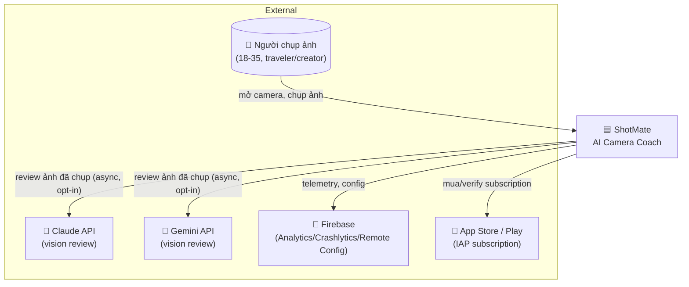
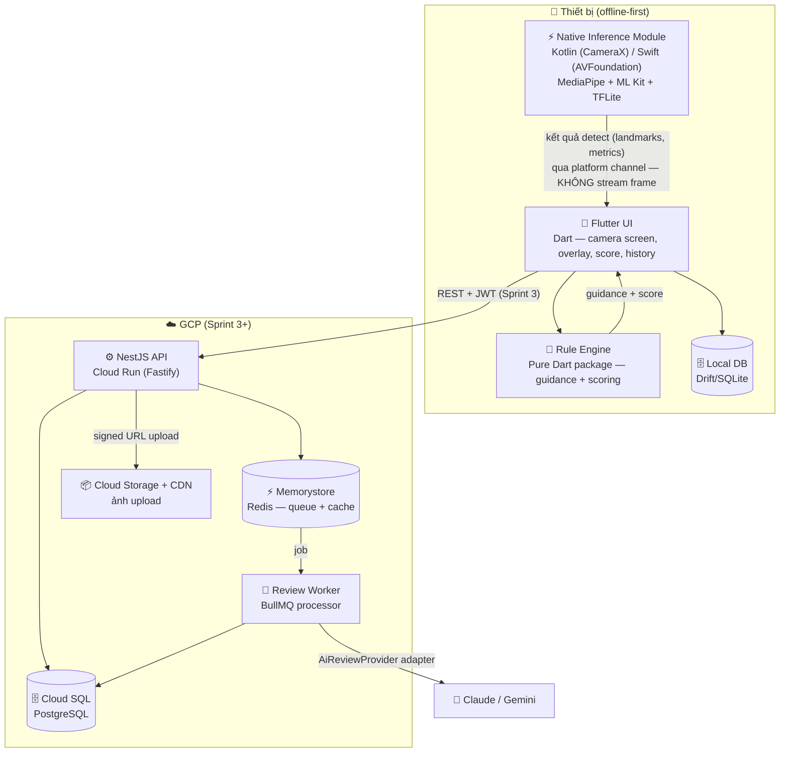
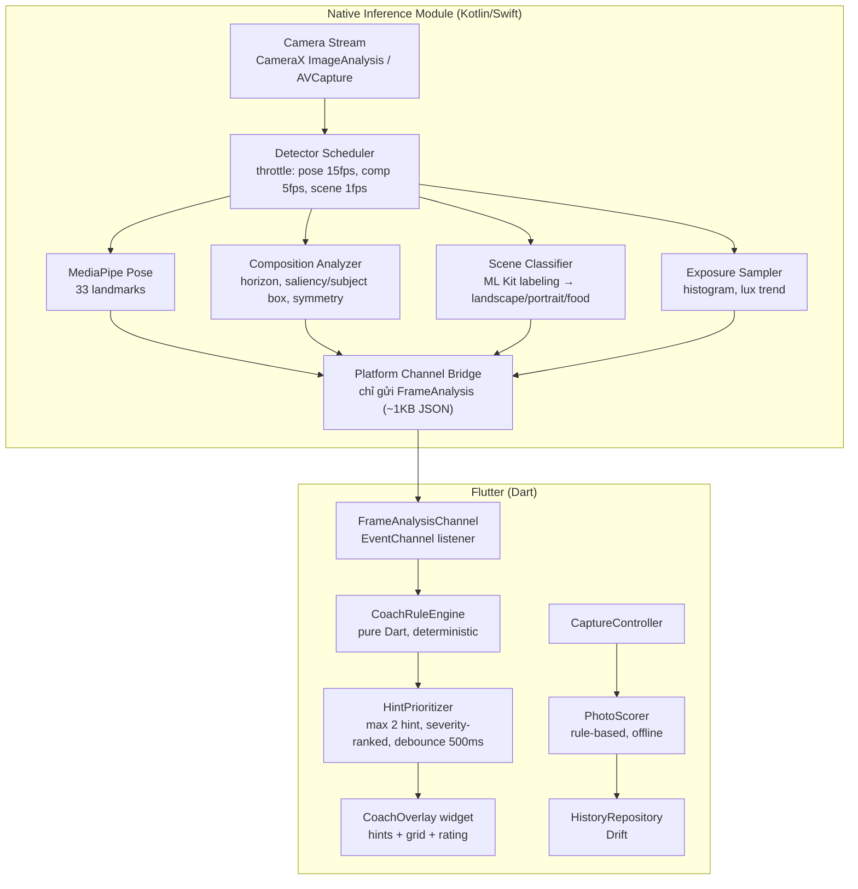
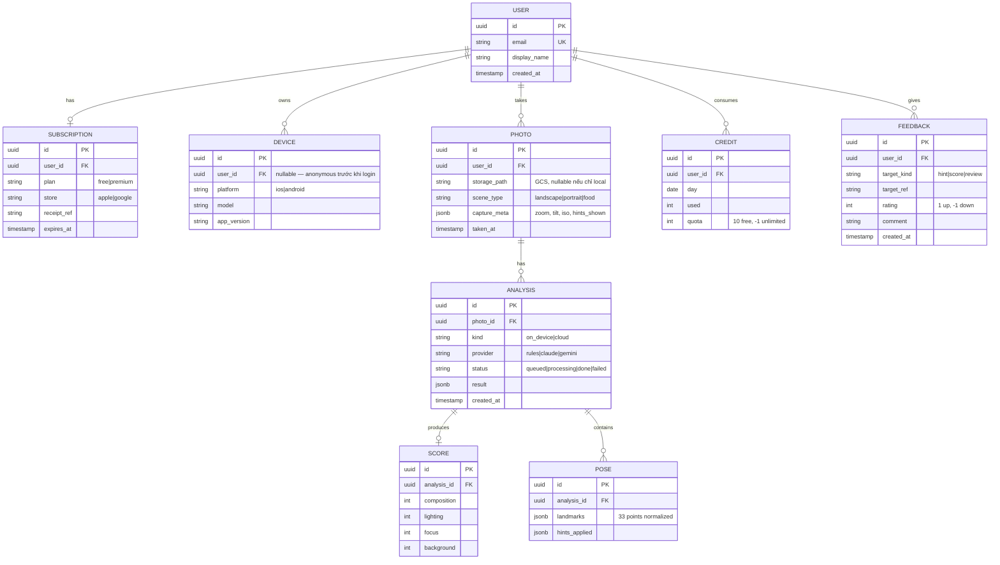
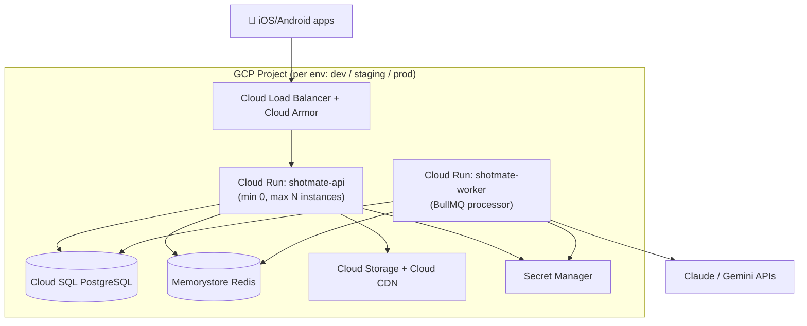

# System Design: ShotMate — AI Camera Coach

<!--
System Design Document (Technical Architecture)
Filename: docs/design/system-design-shotmate.md
Owner: Architect (/architect)
Handoff to: Builder (/builder), Security Auditor (/security-auditor)
Uses C4 model (Context → Container → Component)
-->

## Metadata

**Status:** Approved
**Author:** Đạt Trần
**Date:** 2026-07-03
**Beads Issue:** N/A
**Related PRD:** [PRD-shotmate-mvp.md](../prd/PRD-shotmate-mvp.md)
**Related ADRs:** [0001](../adr/0001-native-side-frame-processing.md), [0002](../adr/0002-offline-first-backend-sprint-3.md), [0003](../adr/0003-rule-engine-realtime-guidance.md), [0004](../adr/0004-cloud-ai-provider-adapter.md), [0005](../adr/0005-local-storage-drift.md), [0006](../adr/0006-on-device-ml-stack.md)

**Tech Strategy Alignment:**
- [x] Language/Framework follows Golden Path (`.claude/rules/tech-strategy.md` của repo shotmate)
- [x] Database choice aligns: PostgreSQL cho OLTP (backend), Drift/SQLite cho local
- [x] Infrastructure tier: GCP Cloud Run (serverless, scale-to-zero phù hợp giai đoạn đầu)
- [x] Observability: OpenTelemetry + Cloud Monitoring (backend, Sprint 3)
- [x] Deviations: Isar → Drift, documented trong ADR-0005

## Executive Summary

ShotMate là app camera Flutter (iOS + Android) hướng dẫn người dùng chụp ảnh đẹp **trước khi bấm nút**: composition, pose, zoom, distance, angle, lighting — realtime < 100ms, chạy hoàn toàn on-device. Sau khi chụp, ảnh được chấm điểm offline bằng rule engine; user Premium có thể gửi ảnh lên cloud để AI (Claude / Gemini Flash) phân tích sâu và giải thích. Hệ thống offline-first: Sprint 1–2 không cần backend; backend NestJS trên GCP Cloud Run vào Sprint 3 cho auth, sync, subscription và cloud AI review.

---

## 1. Context (C4 Level 1)

### System Context Diagram



### Actors & External Systems

| Actor/System | Type | Description | Interaction |
|--------------|------|-------------|-------------|
| Người chụp ảnh | Person | User phổ thông 18–35 (giai đoạn 1), creator/seller sau | Dùng camera trong app, nhận guidance realtime, xem score |
| Claude API | System | Cloud vision review (chất lượng giải thích cao) | HTTPS từ backend, async qua queue |
| Gemini API | System | Cloud vision review (chi phí thấp, cùng hệ GCP) | HTTPS từ backend, async qua queue |
| Firebase | System | Analytics, Crashlytics, Remote Config (feature flags, chọn AI provider, rule tuning) | SDK trong app |
| App Store / Play Billing | System | Subscription Premium | IAP SDK, server verify Sprint 3 |

---

## 2. Containers (C4 Level 2)

### Container Diagram



### Container Descriptions

| Container | Technology | Purpose | Scaling Strategy |
|-----------|------------|---------|------------------|
| Flutter UI | Flutter, Riverpod, GoRouter, Freezed | Camera preview, overlay hints, score screen, history | N/A (client) |
| Native Inference Module | Kotlin/CameraX + Swift/AVFoundation, MediaPipe/ML Kit/TFLite | Phân tích frame realtime NGAY TẠI native side, đẩy kết quả gọn (JSON/struct) về Dart | Adaptive throttling per-detector (ADR-0001, NFR-2) |
| Rule Engine | Pure Dart package (không dependency Flutter) | Map detection results → guidance instructions + photo score. Unit-testable 100% | N/A |
| Local DB | Drift (SQLite) | History ảnh, analysis, score, credit đếm ngày | N/A |
| NestJS API | NestJS + Fastify, Prisma | Auth (JWT + magic link), user, photo metadata, subscription, credits | Cloud Run autoscale 0→N |
| Review Worker | BullMQ processor (cùng codebase, chạy như Cloud Run job/service) | Gọi Claude/Gemini phân tích ảnh, lưu kết quả | Scale theo queue depth |
| Cloud SQL | PostgreSQL | Source of truth server-side | Vertical trước, read replica sau |
| Memorystore | Redis | BullMQ queue, cache credit/session | Managed |
| Cloud Storage | GCS + Cloud CDN | Ảnh user upload (resize client-side trước) | Managed |

---

## 3. Components (C4 Level 3)

### App Components (realtime pipeline — phần quan trọng nhất)



### Component Responsibilities

| Component | Responsibility | Dependencies |
|-----------|---------------|--------------|
| Detector Scheduler (native) | Điều phối tần suất chạy từng detector theo thermal state + scene | Camera stream |
| Composition Analyzer (native) | Horizon angle, subject bounding box, rule-of-thirds offset, symmetry score | OpenCV-lite/custom + ML Kit object detection |
| Platform Channel Bridge | Serialize `FrameAnalysis` → EventChannel. KHÔNG bao giờ gửi pixel data | — |
| CoachRuleEngine (Dart) | `FrameAnalysis` → `List<CoachHint>` + `CompositionRating`. Deterministic, không I/O | freezed models |
| HintPrioritizer | Chọn tối đa 2 hint theo severity, debounce để hint không nhấp nháy | CoachRuleEngine |
| PhotoScorer | Ảnh chụp → score 4 chiều (Composition/Lighting/Focus/Background) từ analysis cuối + sharpness | CoachRuleEngine, native sharpness metric |
| CreditTracker | Đếm phân tích/ngày, reset 00:00 local; Sprint 3 sync server | Drift |

### Backend Components (Sprint 3)

| Component | Responsibility | Dependencies |
|-----------|---------------|--------------|
| AuthModule | Magic link + JWT (access/refresh) | UsersModule, Mailer |
| PhotosModule | Metadata ảnh, signed URL upload GCS | GCS |
| AnalysisModule | Nhận request review, enqueue BullMQ, trả kết quả | Redis, AiReviewModule |
| AiReviewModule | `AiReviewProvider` interface + `ClaudeReviewProvider` + `GeminiReviewProvider`; chọn qua config/Remote Config (ADR-0004) | Claude/Gemini SDK |
| CreditsModule | Enforce 10 review/ngày free, unlimited premium | Redis (counter), Postgres |
| SubscriptionsModule | Verify IAP receipt, trạng thái premium | Store APIs |

---

## 4. Key Design Decisions

| Decision | Options Considered | Chosen | Rationale |
|----------|-------------------|--------|-----------|
| Frame processing | Native side vs Dart side vs hybrid | **Native side, chỉ gửi kết quả** | Stream frame qua platform channel không đạt <100ms (ADR-0001) |
| Realtime guidance | Rule engine vs on-device LLM vs cloud LLM | **Rule engine deterministic** | <5ms, testable, không tốn pin/API (ADR-0003) |
| Backend timing | Từ đầu vs Sprint 3 | **Offline-first, backend Sprint 3** | Beta sớm, giảm rủi ro (ADR-0002) |
| Cloud AI | 1 provider vs adapter đa provider | **Adapter: Claude + Gemini Flash** | Benchmark thật, đổi qua Remote Config, không vendor lock (ADR-0004) |
| Local storage | Hive vs Isar vs Drift | **Drift** | Isar unmaintained; cần query cho history (ADR-0005) |
| On-device ML | MediaPipe vs ML Kit vs tự train | **MediaPipe (pose) + ML Kit (face/object/label) + TFLite (custom)** | Trưởng thành, free, cross-platform (ADR-0006) |

---

## 5. API Design (Sprint 3)

### Endpoints Overview

| Method | Endpoint | Purpose | Auth Required |
|--------|----------|---------|---------------|
| POST | `/api/v1/auth/magic-link` | Gửi magic link đăng nhập | No |
| POST | `/api/v1/auth/verify` | Verify token → JWT pair | No |
| POST | `/api/v1/auth/refresh` | Refresh access token | Refresh JWT |
| GET | `/api/v1/me` | Profile + subscription + credits còn lại | Yes |
| POST | `/api/v1/photos/upload-url` | Lấy signed URL upload GCS | Yes |
| POST | `/api/v1/photos/:id/review` | Enqueue cloud AI review | Yes (trừ credit) |
| GET | `/api/v1/photos/:id/review` | Poll kết quả review | Yes |
| GET | `/api/v1/photos` | List history (paginated) | Yes |
| POST | `/api/v1/sync` | Đẩy batch local history lên server | Yes |
| POST | `/api/v1/subscriptions/verify` | Verify IAP receipt | Yes |
| POST | `/api/v1/feedback` | Feedback cho hint/score | Yes |

### Request/Response Examples

```typescript
// POST /api/v1/photos/:id/review — Response 202
interface ReviewQueuedResponse {
  reviewId: string;
  status: 'QUEUED';
  creditsRemaining: number; // -1 = unlimited (premium)
}

// GET /api/v1/photos/:id/review — Response 200
interface ReviewResult {
  reviewId: string;
  status: 'QUEUED' | 'PROCESSING' | 'DONE' | 'FAILED';
  provider: 'claude' | 'gemini';
  scores: { composition: number; lighting: number; focus: number; background: number };
  explanation: string;        // ngôn ngữ tự nhiên, tiếng Việt
  suggestions: string[];      // gợi ý cải thiện cụ thể
  createdAt: string;          // ISO 8601
}

// Error envelope
interface ErrorResponse {
  error: { code: string; message: string; details?: unknown };
}
```

### API Versioning Strategy

URL path (`/api/v1/`). Breaking change → `/api/v2/`, giữ v1 tối thiểu 6 tháng (app cũ trên store update chậm).

---

## 6. Data Model

### Entity Relationship Diagram



### Key Entities

| Entity | Description | Retention Policy |
|--------|-------------|------------------|
| User | Tài khoản (email magic link) | Indefinite; xoá theo GDPR request |
| Photo | Metadata ảnh; pixel chỉ upload khi opt-in review | Ảnh GCS: 90 ngày free, indefinite premium |
| Analysis | Kết quả phân tích (on-device hoặc cloud) | Theo Photo |
| Credit | Counter phân tích/ngày | 90 ngày |
| Feedback | Đánh giá hint/score — nguồn tuning rule engine | Indefinite |

### Data Migration Strategy

- Local: Drift schema migration (versioned, kèm test)
- Server: Prisma Migrate, forward-only; rollback = migration đảo mới, không sửa migration cũ
- Local → server sync (Sprint 3): last-write-wins theo `taken_at`, ảnh local không tự upload (opt-in)

---

## 7. Security Architecture

### Authentication & Authorization

| Mechanism | Implementation | Notes |
|-----------|----------------|-------|
| Authentication | Magic link email → JWT (access 15m, refresh 30d, rotation) | Không password — giảm attack surface |
| Authorization | Ownership-based: user chỉ truy cập resource của mình | Check ở service layer |
| API Security | Rate limiting per-user + per-IP (Fastify plugin), Cloud Armor WAF | Chống abuse credit |
| Upload | Signed URL GCS ngắn hạn (15 phút), content-type whitelist image/* | Không proxy ảnh qua API |

### Data Protection

- **In Transit:** TLS 1.3 (Cloud Run mặc định); cert pinning cân nhắc sau
- **At Rest:** Cloud SQL + GCS encryption mặc định (Google-managed keys)
- **PII Handling:** Email là PII duy nhất; mask trong log. Ảnh = dữ liệu nhạy cảm nhất → chỉ upload opt-in, xoá được từ app
- **Secrets Management:** GCP Secret Manager (API keys Claude/Gemini, JWT secret, SMTP); local dev dùng `.env` (gitignored)
- **On-device:** frame camera KHÔNG rời thiết bị (NFR-3) — điểm bán hàng về privacy

### Security Considerations

| STRIDE Threat | Mitigation |
|---------------|------------|
| Spoofing | JWT ngắn hạn + refresh rotation; magic link TTL 10 phút, single-use |
| Tampering | Signed URL upload; IAP receipt verify server-side (không tin client) |
| Repudiation | Audit log các thao tác credit/subscription |
| Information Disclosure | Ảnh private per-user; signed URL đọc ngắn hạn; error message không lộ internal |
| Denial of Service | Rate limit, Cloud Armor, BullMQ concurrency cap, Cloud Run max instances |
| Elevation of Privilege | Không có role admin trong app; admin ops qua GCP IAM riêng |

---

## 8. Non-Functional Requirements

### Performance (realtime pipeline — latency budget)

| Stage | Budget | Measurement |
|-------|--------|-------------|
| Camera frame → detector (native) | ~35ms (pose @ 15fps window) | Native trace |
| Detection inference | ≤ 30ms (pose), ≤ 15ms (composition) | MediaPipe/MLKit benchmark |
| Platform channel (kết quả ~1KB) | ≤ 2ms | Dart timeline |
| Rule engine + prioritizer | ≤ 5ms | Unit benchmark |
| Overlay render | ≤ 16ms (1 frame @60fps) | Flutter DevTools |
| **Tổng frame→hint** | **< 100ms p90** | In-app perf HUD (debug build) |
| Photo score sau capture | < 2s | — |
| Cloud review end-to-end | < 10s p90 | OTel trace (Sprint 3) |

### Scalability

| Dimension | Current Capacity | Target Capacity | Strategy |
|-----------|------------------|-----------------|----------|
| Users | 0 | 100k MAU năm 1 | Client-heavy design: realtime không chạm server |
| Review req/s | 0 | ~20 req/s peak | Cloud Run autoscale + BullMQ buffer |
| Ảnh storage | 0 | ~5TB | GCS + lifecycle rules |

### Availability & Reliability

| Metric | Target | Strategy |
|--------|--------|----------|
| App core (guidance) | 100% offline | Không phụ thuộc mạng |
| API availability | 99.5% (giai đoạn đầu) | Cloud Run multi-zone; degrade gracefully — app vẫn dùng được khi API chết |
| RTO | 4 giờ | Redeploy từ image + Cloud SQL backup |
| RPO | 24 giờ (daily backup) → 5 phút (PITR khi có doanh thu) | Cloud SQL automated backup |

### Observability

| Pillar | Implementation | Tools |
|--------|----------------|-------|
| Metrics (app) | Firebase Analytics events: hint_shown, hint_followed, photo_scored, review_requested | Firebase |
| Crashes | Crashlytics | Firebase |
| Metrics (backend) | OpenTelemetry → Cloud Monitoring | OTel SDK NestJS |
| Logging | Structured JSON (pino) | Cloud Logging |
| Tracing | OTLP traces (review pipeline: API→queue→provider) | Cloud Trace |
| Alerting | Error rate, queue depth, AI provider failure rate | Cloud Monitoring alerts |

---

## 9. Infrastructure

### Deployment Architecture



### Environment Configuration

| Environment | Purpose | Infrastructure |
|-------------|---------|----------------|
| Local | Dev hằng ngày | Docker Compose: postgres, redis, minio (giả GCS), mailpit (giả SMTP), backend |
| Dev | Integration, app trỏ vào | Cloud Run min-0, Cloud SQL db-f1-micro, Redis basic |
| Staging | Mirror production, test trước release | Cấu hình = prod, size nhỏ |
| Production | Live | Cloud Run autoscale, Cloud SQL HA (khi có doanh thu), Cloud Armor |

### CI/CD Pipeline (GitHub Actions)

```
feature branch → PR → lint + test (app: flutter analyze/test; backend: eslint/vitest)
  → build (apk/ipa qua Fastlane; backend Docker image)
  → deploy dev (auto)
  → manual approve → deploy staging
  → manual approve → deploy production + tag version
```

App release: Fastlane → TestFlight / Play Internal track (Sprint 3 beta).

---

## 10. Dependencies

### Internal Dependencies

| Service | Purpose | Criticality | Fallback |
|---------|---------|-------------|----------|
| Rule Engine package | Toàn bộ guidance + scoring | High | Không có — phải có test coverage cao |
| Native Inference Module | Detection realtime | High | Graceful degrade: detector nào fail thì tắt nhóm hint đó |

### External Dependencies

| Service | Purpose | SLA | Fallback |
|---------|---------|-----|----------|
| Claude API | Cloud review (chất lượng cao) | Best effort | Failover sang Gemini (adapter, ADR-0004) |
| Gemini API | Cloud review (chi phí thấp) | Best effort | Failover sang Claude |
| Firebase | Analytics/Crashlytics/Remote Config | 99.95% | App hoạt động bình thường không có Firebase |
| MediaPipe/ML Kit models | On-device detection | Bundled | Bundle trong app, không tải runtime |

---

## 11. Risks & Mitigations

| Risk | Probability | Impact | Mitigation |
|------|-------------|--------|------------|
| Latency <100ms fail trên máy tầm trung | Med | High | Benchmark gate tuần 1 Sprint 1; giảm resolution phân tích; throttle |
| Thermal throttling session dài | Med | High | Detector Scheduler adaptive theo thermal API (iOS ProcessInfo / Android Thermal) |
| Hint flickering (rule dao động quanh threshold) | High | Med | Hysteresis + debounce 500ms trong HintPrioritizer |
| Model size làm app > 150MB | Low | Med | Chọn model lite variants; on-demand asset packs nếu cần |
| AI provider đổi giá/quota | Med | Med | Adapter 2 provider + Remote Config switch |
| Solo dev bandwidth | High | High | Offline-first cắt backend khỏi critical path; scope V1 chỉ 3 scene |

---

## 12. Implementation Phases

### Phase 1 — Sprint 1 (Foundation, 2 tuần)
- [ ] Flutter scaffold + camera preview + overlay framework
- [ ] Native inference module: MediaPipe pose + horizon/thirds analyzer
- [ ] Rule engine v0: rule-of-thirds hints + rating sao
- [ ] Photo score cơ bản (offline)
- [ ] Perf HUD + benchmark <100ms (go/no-go gate)

### Phase 2 — Sprint 2 (Core Coaching, 2 tuần)
- [ ] Pose Guide hints, Zoom Suggestion (scene classifier), Distance, Angle
- [ ] Smart Countdown (lighting trend)
- [ ] History local (Drift), credit tracker device-local
- [ ] Photo Review screen hoàn chỉnh

### Phase 3 — Sprint 3 (Backend + Beta, 2 tuần)
- [ ] NestJS API: auth magic link, sync, subscription, credits
- [ ] Cloud AI review pipeline (BullMQ + Claude/Gemini adapter)
- [ ] IAP subscription + RevenueCat (nếu chốt)
- [ ] Beta: TestFlight + Play Internal

---

## 13. Open Questions

- [ ] Distance estimation: dùng kích thước bounding box người (heuristic) hay ARCore/ARKit depth? (heuristic trước — đủ cho "step back 60cm")
- [ ] Symmetry/leading-line detection: thuật toán cụ thể chốt trong Sprint 2 spike
- [ ] Có cần chế độ selfie (camera trước) trong MVP không?

---

## Appendix

### Glossary

| Term | Definition |
|------|------------|
| FrameAnalysis | Payload kết quả detect 1 frame từ native → Dart (~1KB, không pixel) |
| CoachHint | 1 chỉ dẫn hiển thị (direction/pose/zoom/angle + severity + icon) |
| Hint hysteresis | Ngưỡng bật ≠ ngưỡng tắt để hint không nhấp nháy |
| Scene type | landscape / portrait / food (V1) |

### References

- MediaPipe Pose Landmarker, Google ML Kit docs
- C4 model — https://c4model.com
- ADRs 0001–0006 trong `docs/adr/`

---

## Approval

| Role | Name | Date | Status |
|------|------|------|--------|
| Architect | Đạt Trần | 2026-07-03 | Approved |
| Engineering Lead | Đạt Trần | 2026-07-03 | Approved |
| Security | — | | Pending |

---

## Changelog

| Date | Author | Change |
|------|--------|--------|
| 2026-07-03 | Đạt Trần | Initial design từ brainstorm session |
